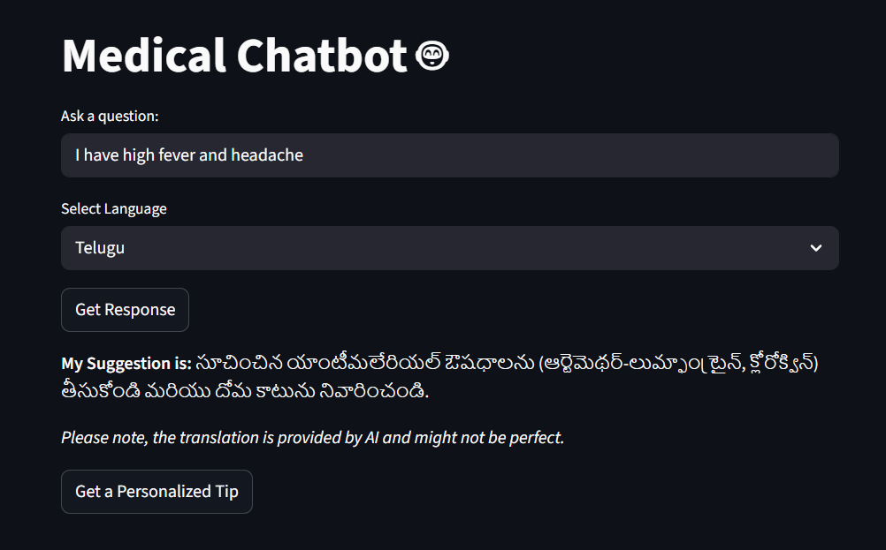

---

# 🏥 AI Health Assistant – Medical Chatbot 🤖

An AI-powered Medical Chatbot built with NLP and Streamlit that provides:

* Disease–Symptom–Cure suggestions
* Personalized health tips
* Multilingual responses
* Semantic similarity-based disease matching

This chatbot helps users receive health guidance in multiple languages through an interactive web interface.

---
🌐 Live Demo

🚀 Try the App Here:
👉 https://ai-health-assistant-deepak.streamlit.app/


🖼️ Application Screenshot



## 🚀 Features

### 🧠 Semantic Disease Matching

Uses **SentenceTransformer (all-MiniLM-L6-v2)** to convert user queries and diseases into embeddings and find the most relevant cure using cosine similarity.

### 💬 Multilingual Support

Integrated with **Google Translator API (deep_translator)** to translate responses into multiple languages.

### 🩺 Medical Keyword Fallback

If semantic similarity is low, keyword-based responses are provided for common symptoms like fever, cough, cold, and headache.

### 🌱 Personalized Health Tips

Provides dynamic health suggestions based on user input (stress, sleep, fatigue, etc.).

### 🎨 Interactive UI

Built using **Streamlit** for a clean and user-friendly web interface.

---

## 🛠️ Technologies Used

* **Python**
* **Streamlit**
* **SentenceTransformers**
* **PyTorch**
* **Pandas**
* **Deep Translator (Google Translate API)**

---

## 🧠 How It Works

1. User enters a health-related query.
2. The model converts the query into a vector embedding.
3. It compares the embedding with disease embeddings using cosine similarity.
4. If similarity score > threshold (0.5):

   * Returns the matched disease cure.
5. If similarity score < threshold:

   * Uses keyword-based fallback.
6. Response is translated into selected language.
7. Optionally provides a personalized health tip.

---

## 🌍 Supported Languages

* English
* Hindi
* Telugu
* Tamil
* Kannada
* Malayalam
* Gujarati
* Korean
* Turkish
* German
* French
* Arabic
* Urdu
* Japanese

---

## 📂 Project Structure

```
AI-Health-Assistant/
│
├── app.py
├── dataset - Sheet1.csv
├── app_screenshot.png
├── requirements.txt
└── README.md
```

---

## ⚙️ Installation

### 1️⃣ Clone the Repository

```bash
git clone https://github.com/deepak-linkedin/AI-Health-Assistant.git
cd AI-Health-Assistant
```

### 2️⃣ Install Dependencies

```bash
pip install -r requirements.txt
```

If requirements.txt is missing, install manually:

```bash
pip install streamlit pandas sentence-transformers torch deep-translator
```

### 3️⃣ Run the Application

```bash
streamlit run app.py
```

---

## 📌 Example Usage

* Enter: "I have high fever and headache"
* Select language (e.g., Telugu)
* Click **Get Response**
* Receive translated medical suggestion

---

## ⚠️ Disclaimer

This chatbot provides informational health advice only.
It is **not a substitute for professional medical consultation**.
Always consult a qualified healthcare provider for serious medical concerns.

---
